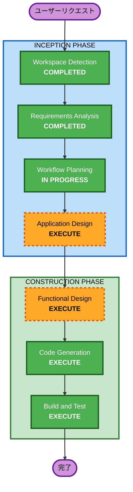

# 実行計画 - 人事・勤怠管理システム (PoC)

## 分析サマリー

### 変更影響評価
- **ユーザー向け変更**: Yes - 新規Webアプリケーション構築
- **構造的変更**: Yes - 新規プロジェクト構造の作成
- **データモデル変更**: Yes - 社員・部署・勤怠のデータモデル新規作成
- **API変更**: N/A - 新規プロジェクト
- **NFR影響**: 低 - PoC段階、ローカル環境のみ

### リスク評価
- **リスクレベル**: 低
- **ロールバック複雑度**: 容易（Greenfield、git revertで対応可能）
- **テスト複雑度**: シンプル

---

## ワークフロー可視化



### テキスト版ワークフロー
```
INCEPTION PHASE:
  [DONE] Workspace Detection
  [SKIP] Reverse Engineering (Greenfield)
  [DONE] Requirements Analysis
  [SKIP] User Stories
  [NOW]  Workflow Planning
  [NEXT] Application Design
  [SKIP] Units Generation (単一ユニット)

CONSTRUCTION PHASE:
  [TODO] Functional Design
  [SKIP] NFR Requirements (PoC)
  [SKIP] NFR Design (PoC)
  [SKIP] Infrastructure Design (ローカルのみ)
  [TODO] Code Generation
  [TODO] Build and Test
```

---

## 実行するステージ

### INCEPTION PHASE
- [x] Workspace Detection (COMPLETED)
- [x] Requirements Analysis (COMPLETED)
- [x] Workflow Planning (IN PROGRESS)
- [ ] Application Design - **EXECUTE**
  - **理由**: 新規プロジェクトのため、コンポーネント構成・エンティティ・サービス層の設計が必要

### CONSTRUCTION PHASE
- [ ] Functional Design - **EXECUTE**
  - **理由**: 社員・部署・勤怠のデータモデルとビジネスロジックの詳細設計が必要
- [ ] Code Generation - **EXECUTE** (ALWAYS)
  - **理由**: 実装コードの生成
- [ ] Build and Test - **EXECUTE** (ALWAYS)
  - **理由**: ビルド・テスト手順の作成

---

## スキップするステージ

### INCEPTION PHASE
- Reverse Engineering - **SKIP**
  - **理由**: Greenfieldプロジェクト
- User Stories - **SKIP**
  - **理由**: PoC段階でスコープが明確、ユーザーペルソナもシンプル（一般社員＋管理者）
- Units Generation - **SKIP**
  - **理由**: 単一ユニット（PoC規模で分割不要）

### CONSTRUCTION PHASE
- NFR Requirements - **SKIP**
  - **理由**: PoC段階、セキュリティルールもスキップ
- NFR Design - **SKIP**
  - **理由**: NFR Requirements をスキップのため
- Infrastructure Design - **SKIP**
  - **理由**: ローカル開発環境のみ、Docker Compose で十分

---

## 成功基準
- **主要目標**: 人事・勤怠管理の基本機能が動作するPoCの完成
- **主要成果物**:
  - .NET + Razor Pages プロジェクト
  - SQL Server (Docker) との接続
  - OAuth2/OIDC 認証
  - 社員・部署・勤務区分マスタのCRUD
  - 勤怠データの登録・一覧・検索
- **品質ゲート**:
  - アプリケーションがローカルで起動・動作すること
  - CRUD操作が正常に機能すること
  - Docker Compose で一括起動できること

---

## Extension Compliance Summary
| Extension | Status | 理由 |
|-----------|--------|------|
| security-baseline | N/A (Disabled) | PoC段階でスキップ（aidlc-state.mdで設定済み） |
